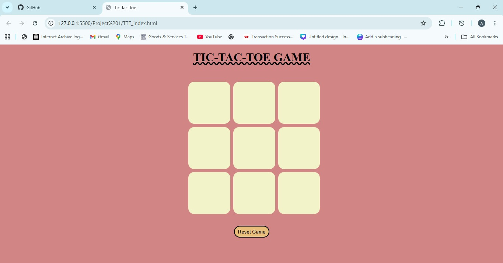
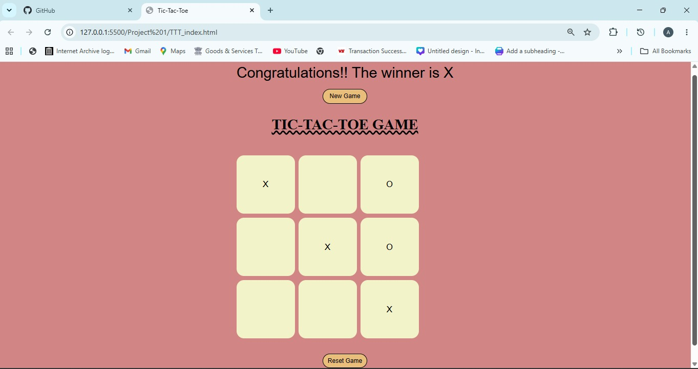

# Tic-Tac-Toe Game

A simple and beginner-friendly Tic-Tac-Toe game built using **HTML**, **CSS**, and **JavaScript**. This project is perfect for beginners who want to learn DOM manipulation, event handling, and basic game logic.

# Features

- Two-player gameplay (Player X vs Player O)
- Interactive and responsive game board
- Win detection
- Restart/New Game option
- Simple and clean user interface

# Technologies Used

- HTML
- CSS
- JavaScript

# How to Run

1. Clone this repository:
   ```bash
   git clone https://github.com/your-username/tic-tac-toe.git
   ```

2. Open the project folder.

3. Double-click `index.html` or open it in your favorite web browser.

# How to Play

- Player **X** always starts first.
- Players take turns clicking on empty boxes.
- The first player to get **three marks in a row** (horizontal, vertical, or diagonal) wins.
- If all boxes are filled without a winner, the game ends in a draw.
- Click the **New Game** button to play again.

# What I Learned

While building this project, I learned:

- HTML structure
- CSS styling and layout
- JavaScript basics
- DOM manipulation
- Event listeners
- Arrays and conditional statements
- Game logic implementation

# Screenshots




# Future Improvements

- Single-player mode (AI)
- Scoreboard
- Sound effects
- Dark/Light mode
- Responsive improvements
